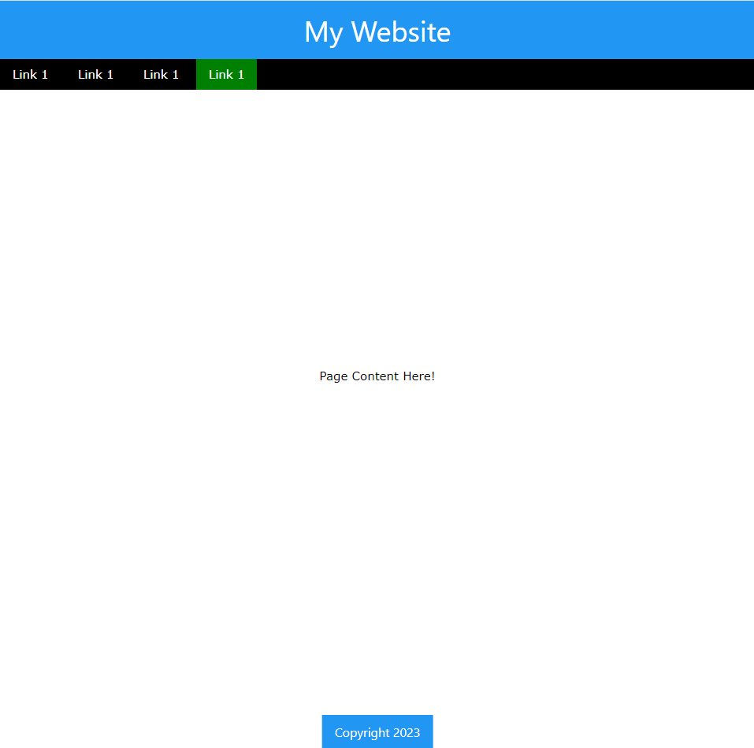

# Layout with W3.CSS
An example of using the W3.CSS library to build a simple webpage layout.

* [W3.CSS Intro](https://www.w3schools.com/w3css/default.asp)
* [Containers for Header & Footer](https://www.w3schools.com/w3css/w3css_containers.asp)
* [Display Middle & Bottom](https://www.w3schools.com/w3css/w3css_display.asp)
* [Navigation Bar](https://www.w3schools.com/w3css/w3css_navigation.asp)

### [Example.html](https://github.com/eniompw/Layout-W3.CSS/blob/main/index.html)

```
<html>
    <head>
        <link rel="stylesheet" href="https://www.w3schools.com/w3css/4/w3.css">
        <style>
            .bg-green {background-color:green;}
        </style>
    </head>
    <body>
        <div class="w3-container w3-blue w3-center">
            <h1>My Website</h1>
        </div>
        <div class=w3-black >
            <a href="#" class="w3-button w3-hover-red">Link 1</a>
            <a href="#" class="w3-button w3-hover-red">Link 1</a>
            <a href="#" class="w3-button w3-hover-red">Link 1</a>
            <a href="#" class="w3-button w3-hover-red bg-green">Link 1</a>
        </div>
        <div class=w3-display-middle>
            Page Content Here!
        </div>
        <div class="w3-container w3-blue w3-display-bottommiddle">
            <h6> Copyright 2023 </h6>
        </div>
    </body>
</html>
```


